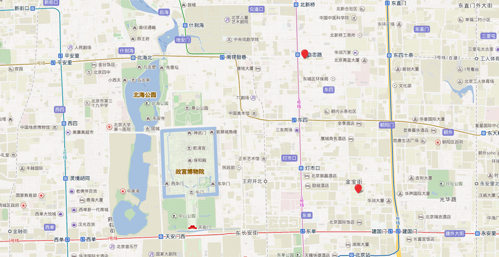
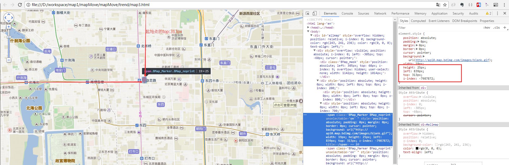
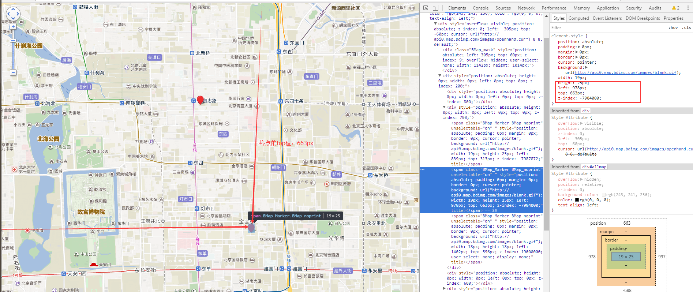

# 在百度地图上显示态势图

在项目上遇到一个问题，需要在百度地图上显示态势图,先来看看结果




此方法没有用到坐标点来实现，只是在添加起点和终点的时候使用了坐标点。看一下思路

1、先获取起点的left和top值



2、获取终点的left和top



3、然后在页面中添加一个一个箭头的div，让这个div的left和top等于**起点的left和top值**,然后left和慢慢变成**终点的left和top值**

大体的思路就这样

```html
<!DOCTYPE html>
<html lang="en">
<head>
	<meta charset="UTF-8">
	<title>Document</title>
	<style type="text/css">
		      body, html,#allmap {width: 100%;height: 100%;overflow: hidden;margin:0;}
	</style>
	<script type="text/javascript" src="http://api.map.baidu.com/api?v=2.0&ak=您的key"></script>
  <script src="jquery-3.2.1.js"></script>
</head>
<body>
	<div id="allmap"></div>
</body>
</html>
<script type="text/javascript">
    var map = new BMap.Map("allmap");
    var point = new BMap.Point(116.405, 39.930);
    map.centerAndZoom(point, 15);
    map.addControl(new BMap.NavigationControl());
    map.enableScrollWheelZoom();
    var myP1 = new BMap.Point(116.425, 39.93936); //起点
    var myP2 = new BMap.Point(116.435, 39.920); //终点
    var marker = new BMap.Marker(myP1)
    var marker2 = new BMap.Marker(myP2)
    map.addOverlay(marker)
    map.addOverlay(marker2)
    marker.addEventListener('click', function(e) {
      var end = marker2.zc //获取事发点marker
      var start = e.target.V // 获取联动单位marker
      var start_left = $(start).css('left') // 联动单位marker的left
      var start_top = $(start).css('top')  // 联动单位marker的top
      var end_left= $(end).css('left')    // 事发点marker的left
      var end_top = $(end).css('top')     // 事发点marker的top
      var x = parseInt(end_left) - parseInt(start_left)
      var y = parseInt(end_top) - parseInt(start_top)
      var tan = x / y
      var deg = (Math.atan(tan) * 180 / Math.PI) // 计算起点与终点的偏移角度
      // 因为最终箭头的的高度在80px,所以不能够已事发点的位置作为最终的到达位置，要重新计算一下
      var new_left = parseInt(end_left) - Math.sin(deg * 2 * Math.PI / 360) * 80 // 计算到达的位置
      var new_top = parseInt(end_top) - Math.cos(deg * 2 * Math.PI / 360) * 80 // 计算到达的位置
      deg = 360 - deg
      // 添加一个箭头
      var div = `<div style="position:absolute;left:${start_left};top:${start_top};width:20px;height:10px;transform:rotate(${deg}deg)" id="map_move">
      
      </div>`
      $(this.map.Vd.EE).append(div)
      $('#map_move').animate({
        height: '80px',
        left: new_left + 'px',
        top: new_top + 'px'
      }, 5000, function() {
        $(this).remove()
      })
    }, false)


</script>
```

